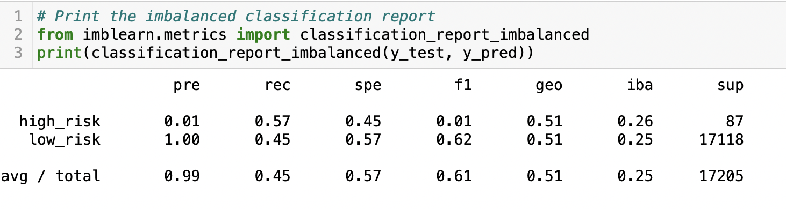

# Credit_Risk_Analysis

# Overview

The purpose of providing this analysis is to provide predictions, based on the data, using supervised machine learning. The goal was to provide a credit risk assessment: are they a good applicant? Are they trust worthy? What are the factors that make someone a high-risk credit applicant? 

In order to proceed with using machine learning, the data needs to “fit” the models being used. Shaping the data into usable data, that would be easily read and fed into the machine learning model. An issue with the data set provided was there were a lot of acceptable credit applicants vs the high-risk applicants. When one outweighs the other the model will more than likely incorrectly categorize future applicants. Since the model is likely to see someone who should be approved it will likely approve them as it doesn’t see many high-risk credit applicants. Especially when it comes to outliers or those who are on the line of being approved or denied. In order to correct the skewed data multiple imports are used to the correct the imbalanced data. 

# Results

The balanced accuracy score, the precision and the recall scores of the 6 machine learning models, is as follows: 

## Naïve Random Oversampling

•	balanced accuracy: 0.6456 
   *	64.6% accuracy 

•	Precision: 
   * low-risk precision: 0.01
   * high-risk precision: 1.00

•	Recall: 
   * High-risk: 0.61
   * Low-risk: 0.68

## SMOTE Oversampling 

•	balanced accuracy: 0.6234
   * 62.3% accuracy 

•	Precision: 
   * low-risk precision: 0.01
   * high-risk precision: 1.00
	
•	Recall: 
   * High-risk: 0.61
   * Low-risk: 0.64

## Undersampling 

•	balanced accuracy: 0.5102
    * 51% accuracy 

•	Precision: 
   * low-risk precision: 0.01
   * high-risk precision: 1.00
 
•	Recall: 
   * High-risk: 0.57
   * Low-risk: 0.45

## Combination (Over and Under) Sampling

•	balanced accuracy: 0.6396 
 * 64% accuracy 

•	Precision: 
   * low-risk precision: 0.01
   * high-risk precision: 1.00
	
•	Recall: 
   * High-risk: 0.70
   * Low-risk: 0.58

## Balanced Random Forest Classifier

•	balanced accuracy: 0.7886
	* 79% accuracy-BRFC

•	Precision: 
   * low-risk precision: 0.03
   * high-risk precision: 1.00
	
•	Recall: 
   * High-risk: 0.70
   * Low-risk: 0.87

## Easy Ensemble AdaBoost Classifier

•	balanced accuracy: 0.9317
	* 93.2% accuracy 

•	Precision: 
   *  low-risk precision: 0.09
   *  high-risk precision: 1.00
	
•	Recall: 
   *  High-risk: 0.92
   *  Low-risk: 0.94

# Summary 
After performing six machine learning models, only two models had an accuracy that was more than 70%. But, of the two, one proved to be incredibly efficient as its accuracy was 93.2%! The best machine learning model is the Easy Ensemble AdaBoost Classifier. When looking at the precision of each of the models, they all look fairly similar as the low-risk candidates stand between 0.1 and 0.9 while high-risk candidates stand at 1.0. It’s important to note the recall of each model as well, as its value will stand between 0 and 1 like the accuracy. The higher the recall value the better the model: proving the best model for our purpose would be the Easy Ensemble AdaBoost Classifier model.

